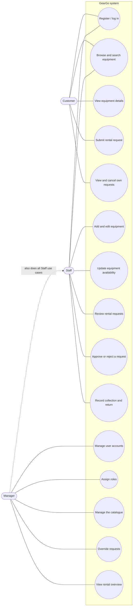
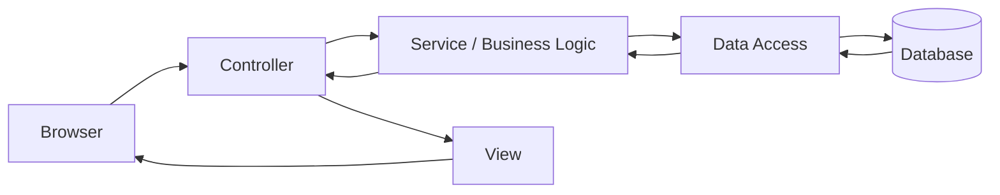
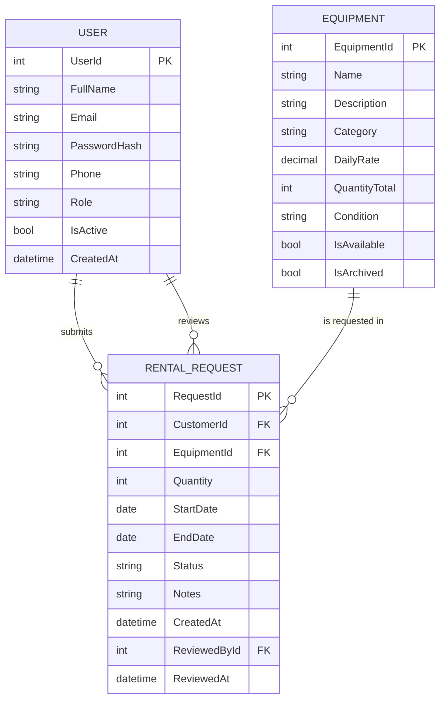

# GearGo: Initial System Analysis & Design

GearGo is a web app for a small equipment-rental business that rents camping equipment, power tools and event equipment. This document is the first design pass: what problem we are solving, who uses the system, what they can do, and how the system is built.

**How to read this document:** start with the problem (section 1), then see who uses the system (2) and what they do (3). Sections 4 to 6 show the same ideas as pictures and tables.

---

## 1. Problem Statement

### The problem today

GearGo has no single place where customers can see what is available and ask to rent it. Availability and requests are assumed to be handled informally (phone calls, messages, notes or spreadsheets). That means staff check stock by hand, confirm dates by going back and forth, and risk double-booking the same item.

> *This is an assumption to confirm with the business owner.*

### Who is affected

| User | How they are affected |
|---|---|
| Customers | Cannot see what is available or what it costs without contacting the business. No clear record of their request or its status. |
| Staff | Spend time answering availability questions, tracking requests by hand and keeping equipment records up to date. |
| Managers | Have no reliable view of the catalogue, demand, or who has access to what. |

### Business impact

- Lost or delayed bookings
- Double-booked or unavailable items
- Wasted staff time
- Inconsistent equipment records
- No data on which items are in demand

### Proposed solution

A web application where:

- **customers** browse the equipment catalogue and submit rental requests,
- **staff** review and process those requests and maintain equipment records,
- **managers** administer the catalogue and user accounts.

### Solution boundary (version 1)

The boundary says what we will and will not build in the first version.

| In scope | Out of scope (for now) |
|---|---|
| User registration and login with role-based access | Online payments and deposits |
| Browsing and searching the equipment catalogue | Delivery and logistics scheduling |
| Submitting, viewing and cancelling rental requests | Damage, fines and insurance handling |
| Staff approval, rejection, collection and return tracking | Invoicing and accounting integration |
| Manager control of catalogue and user accounts | Mobile app (responsive web only) |

---

## 2. User Roles

A **role** is a label that decides what a user is allowed to do. GearGo has three.

| Role | Description | Access |
|---|---|---|
| **Customer** | A member of the public who wants to rent equipment. | Browse equipment, submit and track their own rental requests. |
| **Staff** | Employee running day-to-day rentals. | Everything a customer can see, plus manage equipment records and process all rental requests. |
| **Manager** | Business owner or supervisor. | Everything staff can do, plus manage the catalogue structure, user accounts and roles, and view overviews. |

---

## 3. Use Cases

A **use case** is one thing a user wants to achieve with the system, such as "submit a rental request".

### Customer

| ID | Use case | Summary |
|---|---|---|
| UC-C1 | Register / log in | Create an account and sign in to the system. |
| UC-C2 | Browse and search equipment | View the catalogue, filter by category, search by name. |
| UC-C3 | View equipment details | See description, daily rate and availability for an item. |
| UC-C4 | Submit rental request | Choose an item, quantity and start/end dates, then send the request. |
| UC-C5 | View and cancel own requests | Track request status and cancel a request that is still pending. |

### Staff

| ID | Use case | Summary |
|---|---|---|
| UC-S1 | Log in | Sign in with a staff account. |
| UC-S2 | Add and edit equipment | Create equipment records and update details, rates and condition. |
| UC-S3 | Update equipment availability | Mark items available, unavailable or under maintenance. |
| UC-S4 | Review rental requests | View incoming requests with customer, item and dates. |
| UC-S5 | Approve or reject a request | Decide on a pending request, checking for date conflicts. |
| UC-S6 | Record collection and return | Mark an approved rental as collected, then as returned. |

### Manager

| ID | Use case | Summary |
|---|---|---|
| UC-M1 | Manage user accounts | Create, deactivate or reactivate customer and staff accounts. |
| UC-M2 | Assign roles | Promote or change a user's role (Customer, Staff, Manager). |
| UC-M3 | Manage the catalogue | Manage categories, retire (archive) or restore equipment. |
| UC-M4 | Override requests | Cancel or amend any rental request when needed. |
| UC-M5 | View rental overview | See requests by status and the most requested equipment. |

A Manager can also perform every Staff use case.

---

## 4. Use-Case Diagram

The people (actors) are on the left. The ovals are the things they can do in the system. Everyone logs in, so login is shown once and shared. A Manager can do everything Staff can do (dashed line).

---

## 5. MVC Architecture Sketch

**MVC** stands for Model-View-Controller. It is a way to organise a web app so each part has one job. GearGo adds a separate layer for business rules.

A request travels like this:

In words: **Browser → Controller → Service / Business Logic → Data Access → Database**, with the response travelling back and being rendered by a View.

| Layer | Responsibility | Examples |
|---|---|---|
| Browser | Customer, staff and manager interface; sends HTTP requests. | Catalogue page, request form, staff dashboard. |
| Controller | Receives requests, checks the user's role, calls services, selects the View. | AccountController, EquipmentController, RentalRequestController, AdminController. |
| View | Renders data to HTML for the browser. | Equipment list, request status page. |
| Service / Business Logic | Enforces rules, independent of the web layer. | Dates must be valid; no overlapping approvals for the same item; allowed status changes (Pending → Approved → Collected → Returned). |
| Data Access | Reads and writes data; hides database details. | EquipmentRepository, RentalRequestRepository, UserRepository. |
| Database | Stores the system's data. | Tables: User, Equipment, RentalRequest. |

**Why separate the layers?** Each layer does one job, so the code is easier to read, test and change. For example, you can change how data is stored without touching the pages.

---

## 6. First ERD

An **ERD** (Entity Relationship Diagram) is a picture of the database tables and how they connect. There are three tables. Customers, staff and managers all live in one **User** table, separated by a `Role` column.

**PK** = primary key (uniquely identifies a row). **FK** = foreign key (points to a row in another table).

### User

| Attribute | Notes |
|---|---|
| UserId | Primary key |
| FullName | |
| Email | Unique, used to log in |
| PasswordHash | Never store plain passwords |
| Phone | |
| Role | Customer, Staff or Manager |
| IsActive | Allows deactivation without deleting history |
| CreatedAt | |

### Equipment

| Attribute | Notes |
|---|---|
| EquipmentId | Primary key |
| Name | |
| Description | |
| Category | e.g. Camping, Power Tools, Event |
| DailyRate | Price per day |
| QuantityTotal | Number of units owned |
| Condition | e.g. Good, Needs repair |
| IsAvailable | Whether it can currently be requested |
| IsArchived | Retired items stay in history |

### RentalRequest

| Attribute | Notes |
|---|---|
| RequestId | Primary key |
| CustomerId | Foreign key to User (the requester) |
| EquipmentId | Foreign key to Equipment |
| Quantity | Units requested |
| StartDate / EndDate | Requested rental period |
| Status | Pending, Approved, Rejected, Collected, Returned, Cancelled |
| Notes | Optional customer message |
| CreatedAt | |
| ReviewedById | Foreign key to User (the staff member or manager who decided), can be empty |
| ReviewedAt | Can be empty |

### Relationships

| Relationship | Cardinality |
|---|---|
| A User (customer) submits RentalRequests | One-to-many |
| Equipment is requested in RentalRequests | One-to-many |
| A User (staff or manager) reviews RentalRequests | One-to-many, optional |

**Request status flow:** `Pending` → `Approved` → `Collected` → `Returned`. A request can also end as `Rejected` or `Cancelled`.

**Known simplification:** each request covers one equipment type. If customers need several items in one request, a later version adds a `RentalRequestItem` table between RentalRequest and Equipment.